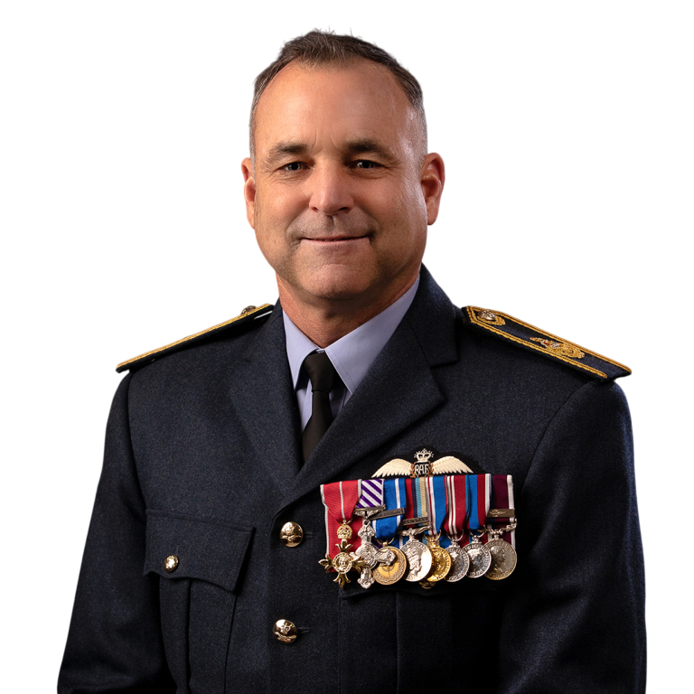
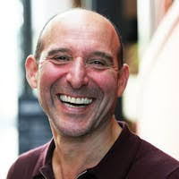

```{=html}
<div class="page-container panels-page">

  <div class="panels-list">
    <section class="panel-session-card">
      <div class="panel-session-header">
        <div>
          <p class="panel-slot">Panel 1</p>
          <h2>Uncertainty, the Future, and Better Decision-Making</h2>
        </div>
      </div>
      <div class="panel-session-summary">
        <p>This panel brings together senior decision-makers from public and private organisations who routinely make decisions about the future under conditions of uncertainty. The conversation explores how leaders work with incomplete information, shifting signals, and evolving risks, and how probabilistic thinking, weak signal sharing, risk assessment, and scenario planning shape real decisions.</p>
      </div>
      <p class="panel-session-meta"><strong>Moderators:</strong> Bahman Rostami-Tabar and Tim Edward</p>
      <div class="panel-people-grid">
        <article class="panel-person-card">
          
          <h3>Prof. Wendy Larner</h3>
          <p>Vice-Chancellor, Cardiff University</p>
          <div class="panel-person-links">
            <a href="https://www.cardiff.ac.uk/about/organisation/university-executive-board/president-and-vice-chancellor" title="Profile" aria-label="Profile"><i class="bi bi-globe"></i></a>
            <a href="https://www.linkedin.com/in/wendy-larner-828326111/" title="LinkedIn" aria-label="LinkedIn"><i class="bi bi-linkedin"></i></a>
          </div>
        </article>

        <article class="panel-person-card">
          
          <h3>Derek Walker</h3>
          <p>The Future Generations Commissioner for Wales</p>
          <div class="panel-person-links">
            <a href="https://futuregenerations.wales/discover/about-future-generations-commissioner/commissioner-for-wales/" title="Profile" aria-label="Profile"><i class="bi bi-globe"></i></a>
            <a href="https://www.linkedin.com/in/derek-walker-8743a528/" title="LinkedIn" aria-label="LinkedIn"><i class="bi bi-linkedin"></i></a>
          </div>
        </article>

        <article class="panel-person-card">
          
          <h3>Dr. Fin Monahan</h3>
          <p>South Wales Fire &amp; Rescue Service</p>
          <div class="panel-person-links">
            <a href="https://www.southwales-fire.gov.uk/newsroom/news/new-chief-fire-officer-appointed/" title="Profile" aria-label="Profile"><i class="bi bi-globe"></i></a>
          </div>
        </article>

        <article class="panel-person-card">
          
          <h3>Dr. David Fluck</h3>
          <p>Medical Director at Cardiff and Vale University Health Board</p>
          <div class="panel-person-links">
            <a href="https://cavuhb.nhs.wales/about-us/our-board/our-board-members/executives/david-fluck/" title="Profile" aria-label="Profile"><i class="bi bi-globe"></i></a>
          </div>
        </article>
      </div>
    </section>

    <section class="panel-session-card">
      <div class="panel-session-header">
        <div>
          <p class="panel-slot">Panel 2</p>
          <h2>Advancing Uncertainty and Futures Research: What Editors Look For</h2>
        </div>
      </div>
      <div class="panel-session-summary">
        <p>This panel brings together editors from leading journals in uncertainty, futures, foresight, and decision-making. The discussion examines how to frame contributions that genuinely advance our understanding of uncertain environments, how methodological innovation and conceptual clarity are assessed, and what editors prioritise when evaluating novelty, rigour, and relevance.</p>
      </div>
      <p class="panel-session-meta"><strong>Chair:</strong> Bahman Rostami-Tabar</p>
      <div class="panel-people-grid">
        <article class="panel-person-card">
          
          <h3>Prof. Pierre Pinson</h3>
          <p>Imperial College London, Editor-in-Chief of the International Journal of Forecasting</p>
          <div class="panel-person-links">
            <a href="https://profiles.imperial.ac.uk/p.pinson" title="Profile" aria-label="Profile"><i class="bi bi-globe"></i></a>
            <a href="https://www.linkedin.com/in/pierrepinson/" title="LinkedIn" aria-label="LinkedIn"><i class="bi bi-linkedin"></i></a>
          </div>
        </article>

        <article class="panel-person-card">
          
          <h3>Dr. Chris Groves</h3>
          <p>Swansea University, Editor-in-Chief of Futures</p>
          <div class="panel-person-links">
            <a href="https://www.swansea.ac.uk/staff/c.r.groves/" title="Profile" aria-label="Profile"><i class="bi bi-globe"></i></a>
            <a href="https://www.linkedin.com/in/crgroves/" title="LinkedIn" aria-label="LinkedIn"><i class="bi bi-linkedin"></i></a>
          </div>
        </article>

        <article class="panel-person-card">
          
          <h3>Prof. Aris Syntetos</h3>
          <p>Cardiff University, Editor-in-Chief of IMA Journal of Management Mathematics</p>
          <div class="panel-person-links">
            <a href="https://profiles.cardiff.ac.uk/staff/syntetosa" title="Profile" aria-label="Profile"><i class="bi bi-globe"></i></a>
            <a href="https://scholar.google.com/citations?user=Da87X7QAAAAJ&amp;hl=en" title="Scholar profile" aria-label="Scholar profile"><i class="bi bi-mortarboard-fill"></i></a>
          </div>
        </article>
      </div>
    </section>
  </div>
</div>
```
