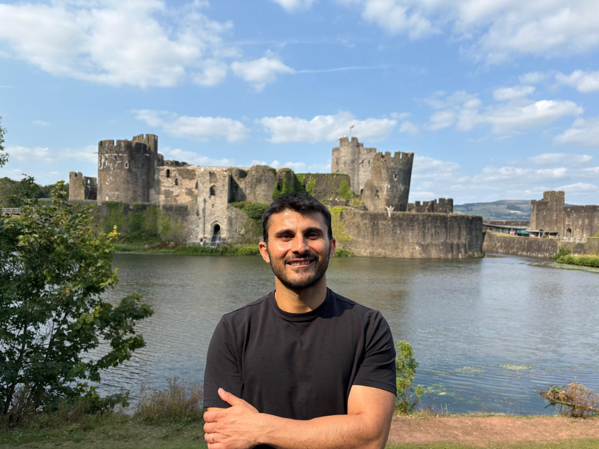
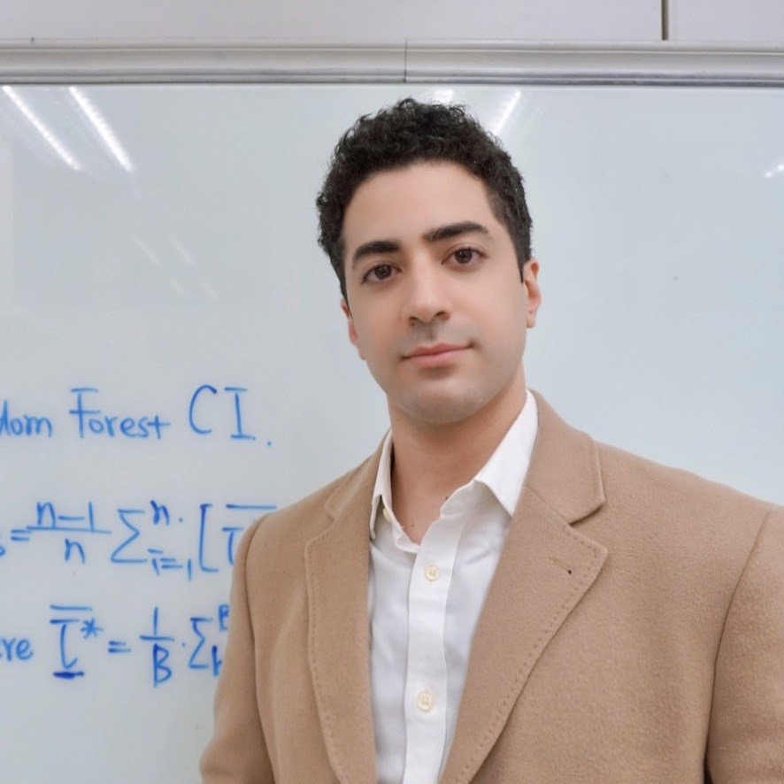
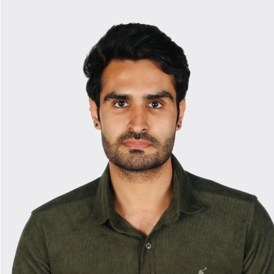
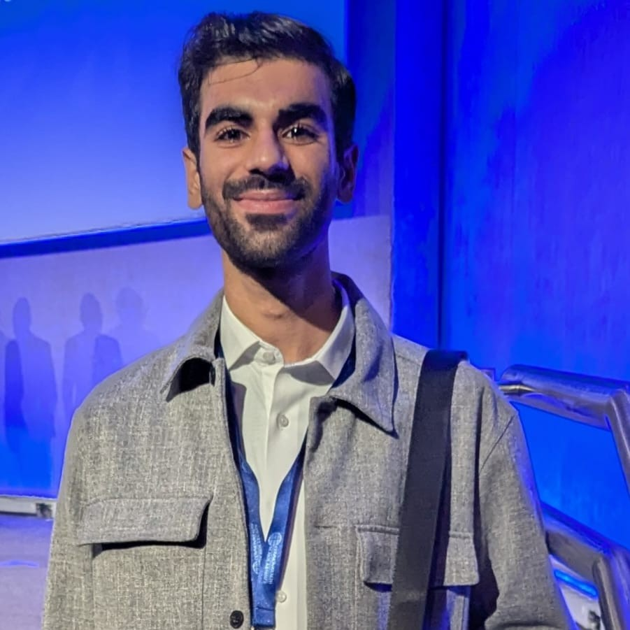
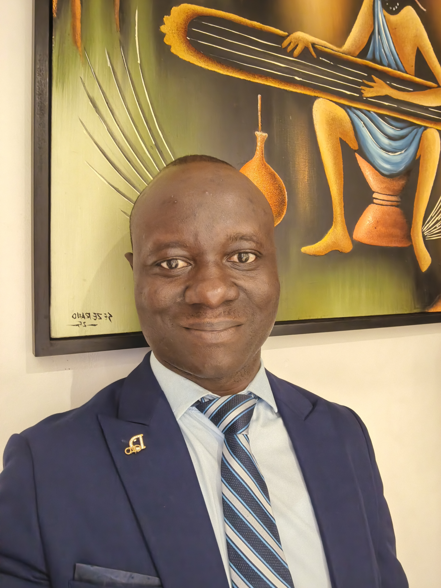

```{=html}
<div class="page-container">
    <div class="section-header">
        <h1> </h1>
        <h1>Meet the Current Cohort.</h1>
        <p>Summer school participants bringing perspectives from institutions around the world.</p>
    </div>

    <div class="content-card">
        <div class="participants-grid">
            <div class="participant-card">
                
                <div class="participant-name">Mustafa Aslan</div>
                <div class="participant-affiliation">DL4SG Research Group, Cardiff Business School, Cardiff University</div>
                <div class="participant-links">
                    <a href="https://mustafaslancoto.github.io/" title="Website" aria-label="Website"><i class="bi bi-globe"></i></a>
                </div>
            </div>

            <div class="participant-card">
                
                <div class="participant-name">Matunga (Mattie) Barwell</div>
                <div class="participant-affiliation">School of Law and Politics, Cardiff University</div>
                <div class="participant-links">
                    <a href="https://www.linkedin.com/in/matungaoriaro" title="LinkedIn" aria-label="LinkedIn"><i class="bi bi-linkedin"></i></a>
                </div>
                <a class="participant-cta" href="matunga-barwell.html" title="Talk details" aria-label="Talk details"><i class="bi bi-file-earmark-text"></i><span>Talk details</span></a>
            </div>

            <div class="participant-card">
                
                <div class="participant-name">Matthew Ray Bobea</div>
                <div class="participant-affiliation">Institute of Service Science at National Tsing Hua University</div>
                <div class="participant-links">
                    <a href="https://mattbobea.com/" title="Website" aria-label="Website"><i class="bi bi-globe"></i></a>
                </div>
                <a class="participant-cta" href="matthew-ray-bobea.html" title="Talk details" aria-label="Talk details"><i class="bi bi-file-earmark-text"></i><span>Talk details</span></a>
            </div>

            <div class="participant-card">
                
                <div class="participant-name">Chigbo Chisom Godswill</div>
                <div class="participant-affiliation">International Research Centre of Excellence, Institute of Human Viology, Nigeria</div>
                <div class="participant-links">
                    <a href="https://www.linkedin.com/in/chisom-god-swill-8993a1173/" title="LinkedIn" aria-label="LinkedIn"><i class="bi bi-linkedin"></i></a>
                </div>
            </div>

            <div class="participant-card">
                
                <div class="participant-name">Moussa Coulibaly</div>
                <div class="participant-affiliation">University of Bordeaux, France</div>
                <div class="participant-links">
                    <a href="https://sites.google.com/view/moussacoulibaly/home" title="Website" aria-label="Website"><i class="bi bi-globe"></i></a>
                </div>
            </div>

            <div class="participant-card">
                
                <div class="participant-name">Patrik Dahl</div>
                <div class="participant-affiliation">School of Social Sciences, Cardiff University</div>
                <div class="participant-links">
                    <a href="https://profiles.cardiff.ac.uk/staff/dahlph" title="Profile" aria-label="Profile"><i class="bi bi-globe"></i></a>
                </div>
                <a class="participant-cta" href="patrik-dahl.html" title="Talk details" aria-label="Talk details"><i class="bi bi-file-earmark-text"></i><span>Talk details</span></a>
            </div>

            <div class="participant-card">
                
                <div class="participant-name">Lucy Dunhill</div>
                <div class="participant-affiliation">Welsh School of Architecture, Cardiff University</div>
                <div class="participant-links">
                    <a href="https://architectureof.agency/" title="Website" aria-label="Website"><i class="bi bi-globe"></i></a>
                </div>
            </div>

            <div class="participant-card">
                
                <div class="participant-name">Xiaohao Fang</div>
                <div class="participant-affiliation">School of Social Sciences, Cardiff University</div>
            </div>

            <div class="participant-card">
                
                <div class="participant-name">Amirhossein Ghadiri</div>
                <div class="participant-affiliation">DL4SG Research Group, Cardiff Business School, Cardiff University</div>
                <div class="participant-links">
                    <a href="https://www.linkedin.com/in/amirhossein-ghadiri-8296781a6/" title="LinkedIn" aria-label="LinkedIn"><i class="bi bi-linkedin"></i></a>
                </div>
                <a class="participant-cta" href="amirhossein-ghadiri.html" title="Talk details" aria-label="Talk details"><i class="bi bi-file-earmark-text"></i><span>Talk details</span></a>
            </div>

            <div class="participant-card">
                
                <div class="participant-name">Roza Ghaedi</div>
                <div class="participant-affiliation">University of Sheffield</div>
                <div class="participant-links">
                    <a href="https://www.linkedin.com/in/roza-ghaedi-b15329231/" title="LinkedIn" aria-label="LinkedIn"><i class="bi bi-linkedin"></i></a>
                </div>
            </div>

            <div class="participant-card">
                
                <div class="participant-name">Harsha Halgamuwe Hewage</div>
                <div class="participant-affiliation">DL4SG Research Group, Cardiff Business School, Cardiff University</div>
                <div class="participant-links">
                    <a href="https://chamara7h.github.io/" title="Website" aria-label="Website"><i class="bi bi-globe"></i></a>
                </div>
            </div>

            <div class="participant-card">
                
                <div class="participant-name">Hani Nasar</div>
                <div class="participant-affiliation">University of St Andrews</div>
                <div class="participant-links">
                    <a href="https://www.linkedin.com/in/hani-nasar/" title="LinkedIn" aria-label="LinkedIn"><i class="bi bi-linkedin"></i></a>
                </div>
            </div>

            <div class="participant-card">
                
                <div class="participant-name">Steven Hopkins</div>
                <div class="participant-affiliation">School of Engineering, Cardiff University</div>
                <div class="participant-links">
                    <a href="https://profiles.cardiff.ac.uk/research-staff/hopkinssp3" title="Profile" aria-label="Profile"><i class="bi bi-globe"></i></a>
                </div>
            </div>

            <div class="participant-card">
                
                <div class="participant-name">Steffan James</div>
                <div class="participant-affiliation">Cardiff Business School, Cardiff University</div>
                <div class="participant-links">
                    <a href="https://www.linkedin.com/in/steffan-james/" title="LinkedIn" aria-label="LinkedIn"><i class="bi bi-linkedin"></i></a>
                </div>
                <a class="participant-cta" href="steffan-james.html" title="Talk details" aria-label="Talk details"><i class="bi bi-file-earmark-text"></i><span>Talk details</span></a>
            </div>

            <div class="participant-card">
                
                <div class="participant-name">Sarah Joseph</div>
                <div class="participant-affiliation">Centre for Study of Islam in Britain, Cardiff University</div>
                <div class="participant-links">
                    <a href="https://www.linkedin.com/Sarahijoseph" title="LinkedIn" aria-label="LinkedIn"><i class="bi bi-linkedin"></i></a>
                </div>
            </div>

            <div class="participant-card">
                
                <div class="participant-name">Olivia Kiely</div>
                <div class="participant-affiliation">Cardiff University/ Prifysgol Caerdydd</div>
                <div class="participant-links">
                    <a href="https://www.cardiff.ac.uk/engineering/people/research-students" title="Profile" aria-label="Profile"><i class="bi bi-globe"></i></a>
                </div>
            </div>

            <div class="participant-card">
                
                <div class="participant-name">Arvind Kumar</div>
                <div class="participant-affiliation">The Institutional Architecture Lab (TIAL)</div>
                <div class="participant-links">
                    <a href="https://www.linkedin.com/in/arvind-kumar-iitm/" title="LinkedIn" aria-label="LinkedIn"><i class="bi bi-linkedin"></i></a>
                </div>
            </div>

            <div class="participant-card">
                <div class="participant-avatar participant-avatar-placeholder" aria-hidden="true"></div>
                <div class="participant-name">Charlie Leedham</div>
                <div class="participant-affiliation">DECIPHer, School of Social Sciences, Cardiff University</div>
                <a class="participant-cta" href="charlie-leedham.html" title="Talk details" aria-label="Talk details"><i class="bi bi-file-earmark-text"></i><span>Talk details</span></a>
            </div>

            <div class="participant-card">
                
                <div class="participant-name">Shuangyi Li</div>
                <div class="participant-affiliation">University College London</div>
                <div class="participant-links">
                    <a href="https://profiles.ucl.ac.uk/101213-shuangyi-li" title="Profile" aria-label="Profile"><i class="bi bi-globe"></i></a>
                </div>
            </div>

            <div class="participant-card">
                <div class="participant-avatar participant-avatar-placeholder" aria-hidden="true"></div>
                <div class="participant-name">Xinru Liang</div>
                <div class="participant-affiliation">Cardiff University</div>
            </div>

            <div class="participant-card">
                <div class="participant-avatar participant-avatar-placeholder" aria-hidden="true"></div>
                <div class="participant-name">Jia Men</div>
                <div class="participant-affiliation">Cardiff University</div>
            </div>

            <div class="participant-card">
                
                <div class="participant-name">Fatemeh Monshizadeh</div>
                <div class="participant-affiliation">DL4SG Research Group, Cardiff Business School, Cardiff University</div>
                <div class="participant-links">
                    <a href="https://www.linkedin.com/in/fatemeh-monshizadeh/" title="LinkedIn" aria-label="LinkedIn"><i class="bi bi-linkedin"></i></a>
                </div>
            </div>

            <div class="participant-card">
                
                <div class="participant-name">Elias Peter Mwakilama</div>
                <div class="participant-affiliation">University of Malawi</div>
                <div class="participant-links">
                    <a href="https://www.unima.ac.mw/staff/search?staff=dr.+elias+peter+mwakilama" title="Profile" aria-label="Profile"><i class="bi bi-globe"></i></a>
                </div>
                <a class="participant-cta" href="elias-peter-mwakilama.html" aria-label="View Elias Peter Mwakilama's talk details">
                    <i class="bi bi-mic"></i><span>Talk details</span>
                </a>
            </div>

            <div class="participant-card">
                <div class="participant-avatar participant-avatar-placeholder" aria-hidden="true"></div>
                <div class="participant-name">Agnes Njambi</div>
                <div class="participant-affiliation">Alliance of Bioversity International and CIAT</div>
            </div>

            <div class="participant-card">
                
                <div class="participant-name">Oussema Omri</div>
                <div class="participant-affiliation">LGI CentraleSup&#233;lec, University of Paris-Saclay &amp; CESIT, KEDGE Business School</div>
                <div class="participant-links">
                    <a href="https://www.linkedin.com/in/oussema-omri/" title="LinkedIn" aria-label="LinkedIn"><i class="bi bi-linkedin"></i></a>
                </div>
            </div>

            <div class="participant-card">
                <div class="participant-avatar participant-avatar-placeholder" aria-hidden="true"></div>
                <div class="participant-name">Wilmar Guillermo Rodriguez Lopez</div>
                <div class="participant-affiliation">Universidad Pedagogica y Tecnologica de Colombia - UPTC</div>
            </div>

            <div class="participant-card">
                
                <div class="participant-name">U&#287;ur &#350;ahan</div>
                <div class="participant-affiliation">CoreXas</div>
                <div class="participant-links">
                    <a href="https://www.linkedin.com/in/ugursahan/" title="LinkedIn" aria-label="LinkedIn"><i class="bi bi-linkedin"></i></a>
                </div>
            </div>

            <div class="participant-card">
                
                <div class="participant-name">Udeshi Salgado</div>
                <div class="participant-affiliation">DL4SG Research Group, Cardiff Business School, Cardiff University</div>
                <div class="participant-links">
                    <a href="https://udeshisalgado.github.io/" title="Website" aria-label="Website"><i class="bi bi-globe"></i></a>
                </div>
            </div>

            <div class="participant-card">
                
                <div class="participant-name">Amir Salimi Babamiri</div>
                <div class="participant-affiliation">DL4SG Research Group, Cardiff Business School, Cardiff University</div>
                <div class="participant-links">
                    <a href="https://profiles.cardiff.ac.uk/staff/salimibabamiria" title="Profile" aria-label="Profile"><i class="bi bi-globe"></i></a>
                </div>
            </div>

            <div class="participant-card">
                
                <div class="participant-name">Sode Idelphonse</div>
                <div class="participant-affiliation">Laboratoire de Biomath&eacute;matiques et d'Estimations Foresti&egrave;res, University of Abomey-Calavi</div>
                <div class="participant-links">
                    <a href="https://github.com/sodeidelphonse" title="GitHub" aria-label="GitHub"><i class="bi bi-github"></i></a>
                </div>
                <a class="participant-cta" href="sode-idelphonse.html" title="Talk details" aria-label="Talk details"><i class="bi bi-file-earmark-text"></i><span>Talk details</span></a>
            </div>

            <div class="participant-card">
                
                <div class="participant-name">Nirushan Sudarsan</div>
                <div class="participant-affiliation">School of Geography and Planning, Cardiff University</div>
                <div class="participant-links">
                    <a href="https://profiles.cardiff.ac.uk/research-staff/sudarsann" title="Profile" aria-label="Profile"><i class="bi bi-globe"></i></a>
                </div>
            </div>

            <div class="participant-card">
                <div class="participant-avatar participant-avatar-placeholder" aria-hidden="true"></div>
                <div class="participant-name">Megan Thorne Roseblade</div>
                <div class="participant-affiliation">Cardiff University</div>
            </div>

            <div class="participant-card">
                
                <div class="participant-name">Xiaoqian Wang</div>
                <div class="participant-affiliation">Academy of Mathematics and Systems Science, Chinese Academy of Sciences</div>
                <div class="participant-links">
                    <a href="https://xqnwang.rbind.io/" title="Website" aria-label="Website"><i class="bi bi-globe"></i></a>
                </div>
            </div>

            <div class="participant-card">
                
                <div class="participant-name">Zhuoli Wu</div>
                <div class="participant-affiliation">Cardiff Catalysis Institute, Cardiff University</div>
                <div class="participant-links">
                    <a href="https://www.linkedin.com/in/zhuoli-wu-44162b159/" title="LinkedIn" aria-label="LinkedIn"><i class="bi bi-linkedin"></i></a>
                </div>
            </div>

            <div class="participant-card">
                
                <div class="participant-name">Rui Xu</div>
                <div class="participant-affiliation">DL4SG Research Group, Cardiff Business School, Cardiff University</div>
                <div class="participant-links">
                    <a href="https://rui-2024.github.io/" title="Website" aria-label="Website"><i class="bi bi-globe"></i></a>
                </div>
            </div>

            <div class="participant-card">
                
                <div class="participant-name">Ling Yuan</div>
                <div class="participant-affiliation">Cardiff University</div>
                <div class="participant-links">
                    <a href="https://profiles.cardiff.ac.uk/research-staff/yuanl18" title="Profile" aria-label="Profile"><i class="bi bi-globe"></i></a>
                </div>
            </div>
        </div>
    </div>
</div>
```
