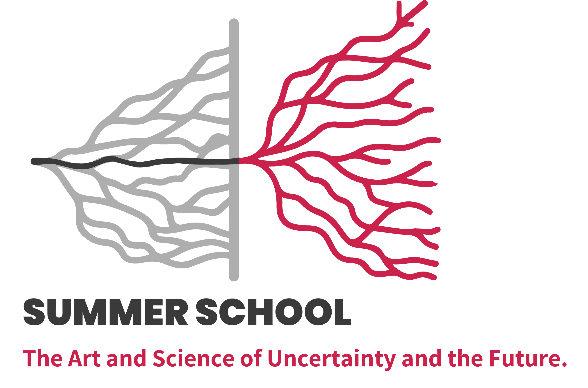
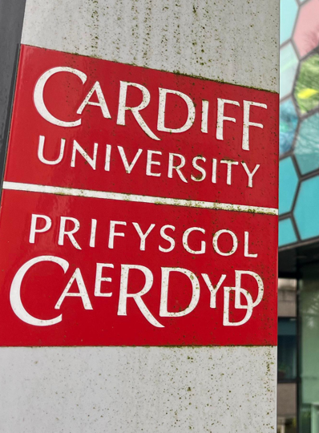
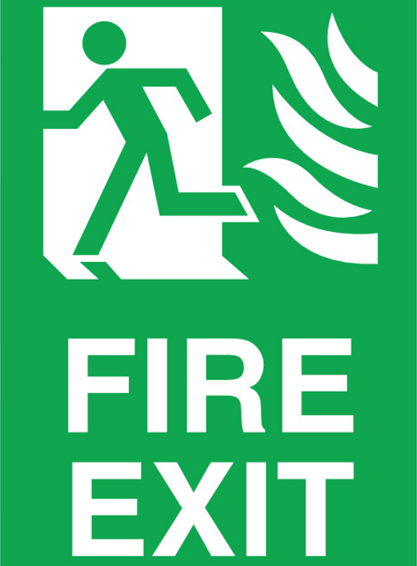

---
format: 
  revealjs:
    slide-number: c/t
    width: 1920
    height: 1080
    logo: "images/logo.png"
    footer: "[Welcome & Practical Information](https://dl4sg-summer-school.github.io/program/)"
    css: theme.css
    echo: true
execute:
  warning: false
  echo: false
header-includes:
  - '<link rel="stylesheet" href="https://cdnjs.cloudflare.com/ajax/libs/font-awesome/6.4.0/css/all.min.css">'
---   

# {.title-slide background-image="images/cover.png" background-size="cover"}

  
  
  

  <h1>Welcome & Practical Information</h1>
  <h2>The Art and Science of Uncertainty and the Future</h2>
  
Monday morning briefing and general information

  
2026/07/06

## {}

:::: {.columns}

::: {.column width="40%"}
{.absolute top="-10%" left="-10%" height="120%" style="max-height: unset;"}
:::

::: {.column width="2.5%"}
:::

::: {.column width="57.5%"}

[Discord is our main communication space]{.highlight-title}

 

<ul>
<li>Check it regularly for daily updates and reminders</li>
<li class="fragment">We will post any room, timing or location changes there</li>
<li class="fragment">Use it for practical questions, social plans and travel coordination</li>
<li class="fragment">Please use your real name so everyone can recognise you</li>
<li class="fragment">Sharing photos and reflections</li>
</ul>

:::

::::

## Use Slido to submit questions during sessions

:::: {.columns}

::: {.column width="40%"}

 
 

:::

::: {.column width="2.5%"}
:::

::: {.column width="57.5%"}

 
 
 
 

Join at: [slido.com](https://app.sli.do/event/v9JDUGw8zQY7RuGb1qVfLu/login?redirect_url=https%3A%2F%2Fapp.sli.do%2Fevent%2Fv9JDUGw8zQY7RuGb1qVfLu)

Event code: [**#UF2026**]{style="color: #C7172D;"}

<ul>
<li>Submit questions while the speaker is presenting</li>
<li class="fragment">Upvote questions you would also like to hear answered</li>
<li class="fragment">This helps us manage discussion time fairly</li>
</ul>

:::

::::

## {}

:::: {.columns}

::: {.column width="40%"}
{.absolute top="-10%" left="-10%" height="120%" style="max-height: unset;"}
:::

::: {.column width="2.5%"}
:::

::: {.column width="57.5%"}

[How to connect to CU-Wireless]{.highlight-title}

 

<ul>
<li markdown="1">Select [**CU-Wireless**]{style="color: #C7172D;"} from the available networks</li>
<li class="fragment">Choose Conference or Guest on the login page</li>
<li class="fragment" markdown="1">Enter the conference name and password below
  <ul>
  <li markdown="1">Conference Name: [**Presentations 0607**]{style="color: #C7172D;"}</li>
  <li markdown="1">Password: [**578758**]{style="color: #C7172D;"}</li>
  </ul>
</li>
<li class="fragment">Active: Monday 06 July 2026, 7:00 AM to Friday 10 July 2026, 7:00 PM</li>
</ul>

:::

::::

## {}

:::: {.columns}

::: {.column width="40%"}
{.absolute top="-10%" left="-10%" height="120%" style="max-height: unset;"}
:::

::: {.column width="2.5%"}
:::

::: {.column width="57.5%"}

[Fire exit and safety information]{.highlight-title}

 

<ul>
<li>Please take a moment to notice your nearest marked fire exit</li>
<li class="fragment">If the fire alarm sounds, leave immediately and calmly</li>
<li class="fragment" markdown="1">Front Exit: Assemble on the wide pavements along [King Edward VII Avenue]{style="color: #C7172D;"}</li>
<li class="fragment">Follow Cardiff University staff and organiser instructions</li>
<li class="fragment">Let us know now if you may need assistance in an evacuation</li>
</ul>

:::

::::

## {}

:::: {.columns}

::: {.column width="40%"}
{.absolute top="-10%" left="-10%" height="120%" style="max-height: unset;"}
:::

::: {.column width="2.5%"}
:::

::: {.column width="57.5%"}

[Housekeeping]{.highlight-title}

<ul>
<li>Main venues: Glamorgan and Bute buildings. Check the programme book/website for room details.</li>
<li class="fragment">Please ensure you have turned your mobile phones to silent during the sessions</li>
<li class="fragment">Toilets are signposted and located on each floor of the conference venues</li>
<li class="fragment">Smoking is not permitted in any Cardiff University building or near any campus building entrances</li>
<li class="fragment">All breaks: Glamorgan Room 1.67. Please check the programme for lunch locations.</li>
<li class="fragment">Quiet space: Room 1.67 is available outside catering times.</li>
<li class="fragment">Prayer spaces: Glamorgan Room -1.77, available 13:00-14:00.</li>
</ul>

:::

::::

## {}

:::: {.columns}

::: {.column width="40%"}
{.absolute top="-10%" left="-10%" height="120%" style="max-height: unset;"}
:::

::: {.column width="2.5%"}
:::

::: {.column width="57.5%"}

[Cardiff tour and site visit]{.highlight-title}

 

Cardiff tour

- A relaxed chance to explore Cardiff together

- Please stay with the group

- Monday: 17:15 – 19:00

 

::: {.fragment}

Site visit on Wednesday

- Meeting point: Glamorgan Building stairs

- Packed lunches will be provided as you board the coach at 12:00

- 12:00: Depart from Cardiff to Big Pit National Coal Museum

- 16:00: Return to Cardiff

- 17:00: Film screening starts at the Centre for Student Life, followed by the gala dinner in Glamorgan at 19:00

:::

:::

::::

## {}

:::: {.columns}

::: {.column width="40%"}
{.absolute top="-10%" left="-10%" height="120%" style="max-height: unset;"}
:::

::: {.column width="2.5%"}
:::

::: {.column width="57.5%"}

[Share your summer school reflections on LinkedIn]{.highlight-title}

 

<ul>
<li>Post reflections, photos, key ideas or questions from the week</li>
<li class="fragment">Tag the summer school page, Cardiff University and Cardiff Business School</li>
<li class="fragment">Also mention Data Lab for Social Good where relevant</li>
<li class="fragment" markdown="1">Use the hashtag [#UF2026]{style="color: #C7172D;"}</li>
<li class="fragment">Three awards will be given to the three posts with the highest engagement: likes, comments and reshares</li>
</ul>

:::

::::

## {background-color="#C7172D" .center}

  <h1>Thank you...</h1>
  
Have a great week at the Art and Science of Uncertainty and the Future Summer School

  
Scan the QR code and follow us on LinkedIn.

